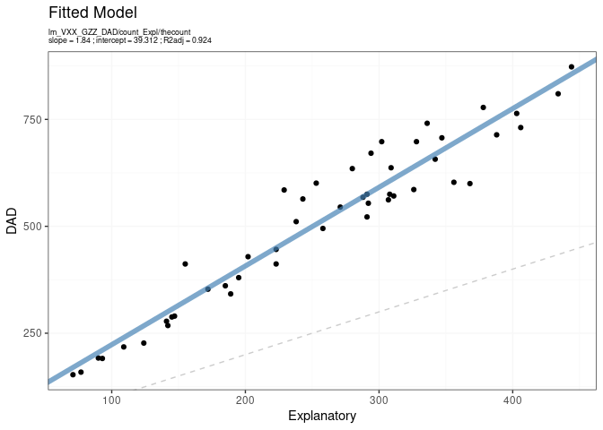
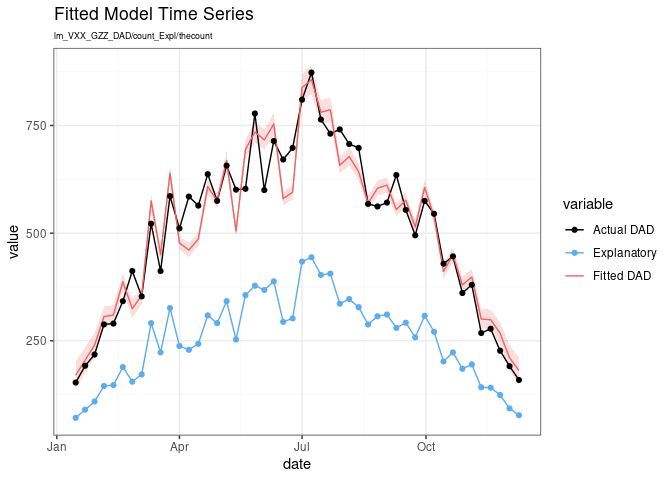
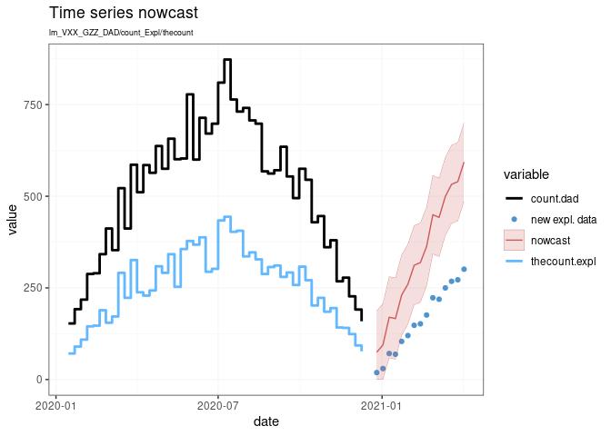

# dadnow - Nowcasting Discharge Abstract Database (DAD)


## Example Usage

Start by loading the data. David has provided functions to produce
sample data in the format expected by the functions.

First, the DAD data:

``` r
library(dadnow)

set.seed(2112)
data.dad  = fake_dad()
data.expl = fake_expl(dad = data.dad)

head(data.dad)
```

            date virus geo count percapita
    1 2020-01-01   VXX GZZ    57  0.000057
    2 2020-01-08   VXX GZZ    99  0.000099
    3 2020-01-15   VXX GZZ   141  0.000141
    4 2020-01-22   VXX GZZ   184  0.000184
    5 2020-01-29   VXX GZZ   254  0.000254
    6 2020-02-05   VXX GZZ   300  0.000300

Next, generate the explanatory variables

``` r
head(data.expl)
```

            date virus geo thecount
    1 2020-01-01   VXX GZZ       31
    2 2020-01-08   VXX GZZ       49
    3 2020-01-15   VXX GZZ       66
    4 2020-01-22   VXX GZZ       98
    5 2020-01-29   VXX GZZ      137
    6 2020-02-05   VXX GZZ      133

``` r
prm = list(
  family = 'lm',
  data.dad = data.dad,
  data.expl = data.expl,
  varname.dad = 'count',
  varname.expl = 'thecount',
  date.range.fit = c('2020-01-10', '2020-12-15')
)

fitted.model = fit_model(prm)

lapply(fitted.model, class)
```

    $model
    [1] "lm"

    $data
    [1] "data.frame"

    $varname.dad
    [1] "character"

    $varname.expl
    [1] "character"

    $family
    [1] "character"

    $date.range.fit
    [1] "Date"

``` r
g.fit = plot_fitted_model(fitted.model)
g.fit$xy
```



``` r
g.fit$timeseries
```



``` r
n = 15
newdata.expl = data.frame(
  date = data.expl$date[1:n] + 360,
  virus = 'VXX',
  geo = 'GZZ',
  thecount = rpois(n, lambda = 20*c(1:n))
)

a = nowcast(fitted.model = fitted.model,
            newdata.expl = newdata.expl)
g.nowc = plot_nowcast(nowc = a)
g.nowc
```


